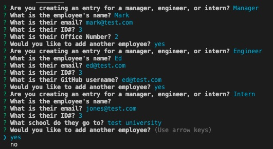
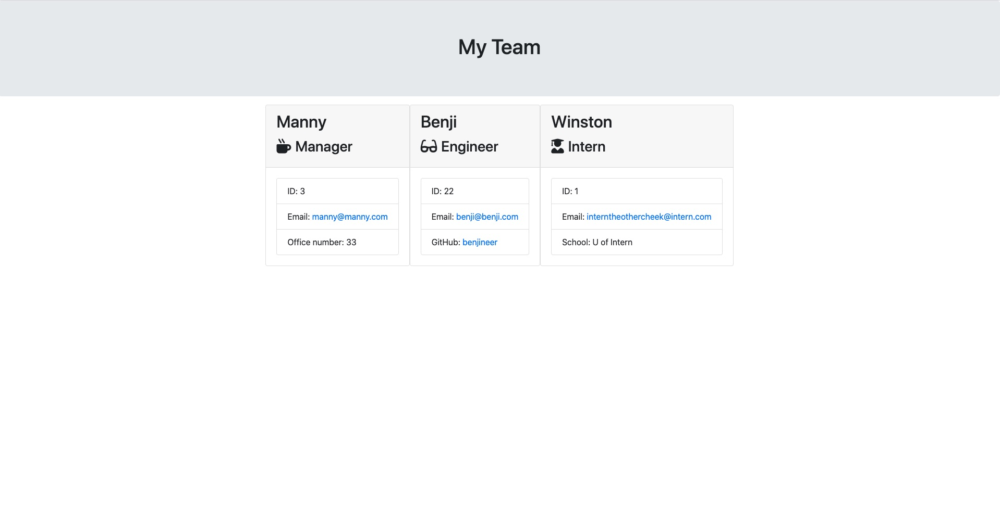

# teammanager

 ## Application
 Team Manager 
### Project Description

---
Use inquirer to create a simple team with various roles, each role will have different attributes

### How to Install
Run the application and answer the questions, this will also generate a page in the browser to view your created team. 
### How to Use this Application
This web application can be used to add team members only, cannot delete team members yet. 
### Techology Used
node, javascript, html, css, inquirer

### Licenses
MIT
### Project Contributers
Jahugawugasuga
### Future Dev
add the ability to remove members from the team, or promote them. 

